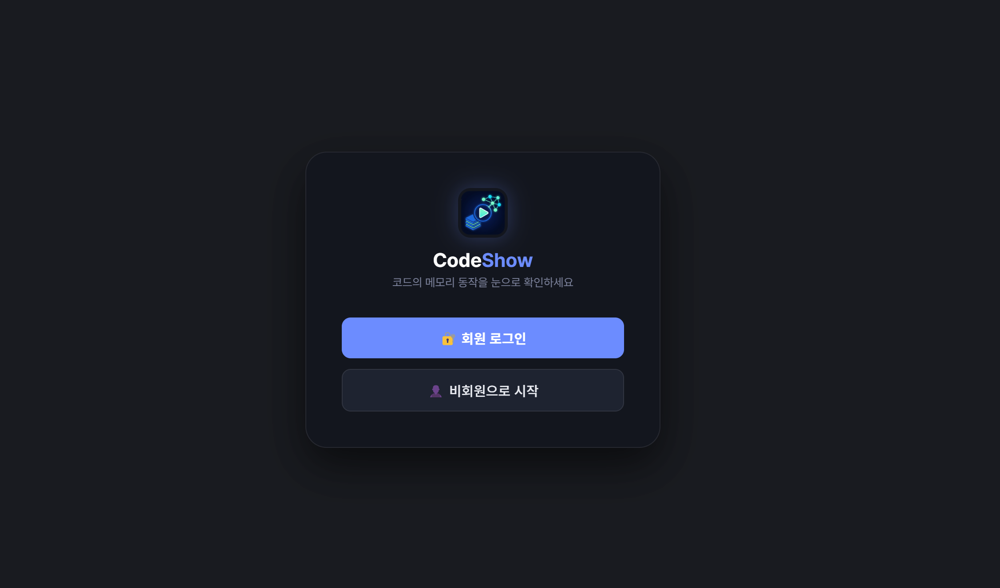
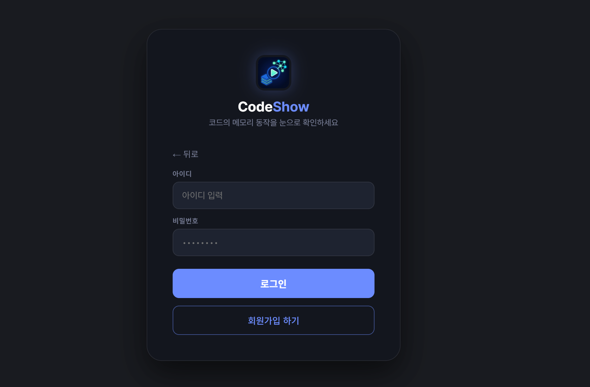
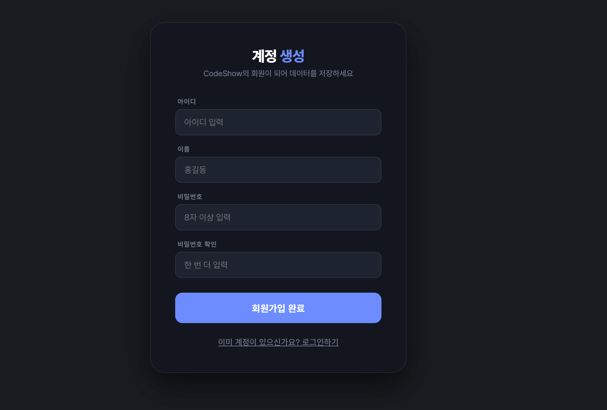
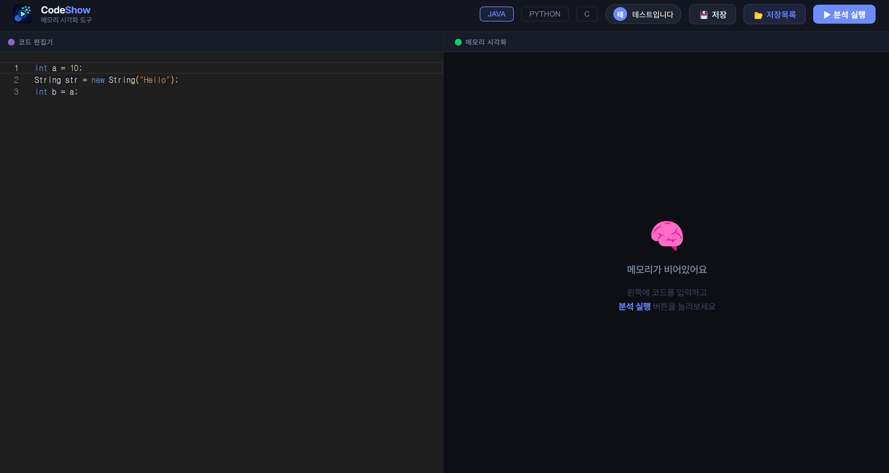
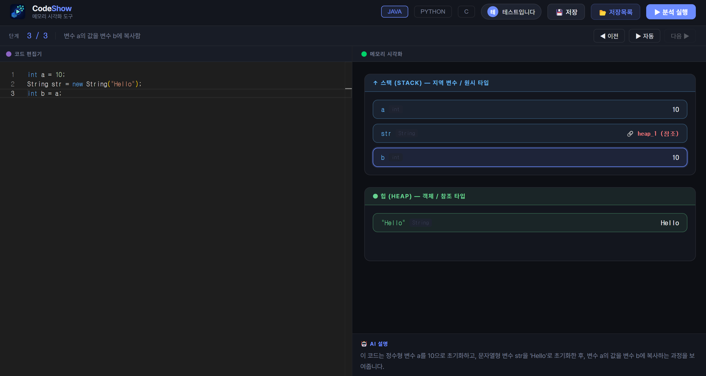
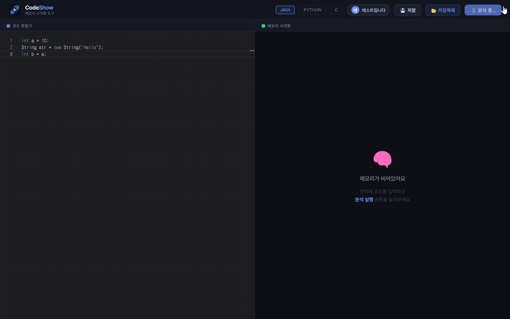
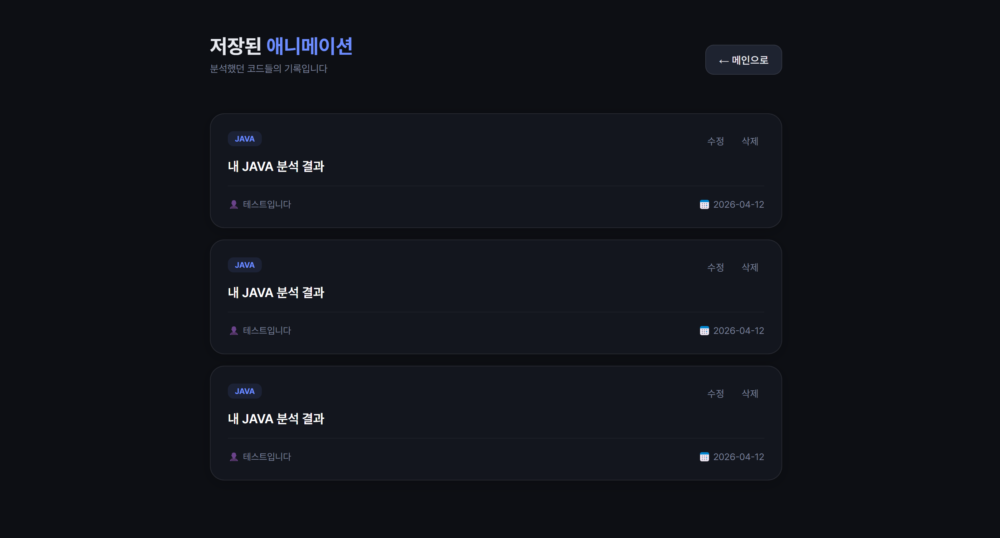

# <sub></sub> CodeShow (코드쑈)

AI가 사용자가 작성한 코드를 분석하고, 실행 과정을 단계별 애니메이션으로 시각화해주는 교육용 웹 서비스입니다.

<br/>

## 🔗 Live Demo
- https://codeshow-ai-app.onrender.com

<br/>

## 📝 프로젝트 개요 (Overview)
CodeShow는 프로그래밍을 처음 배우는 학습자와, 코드 실행 과정을 설명해야 하는 교육자를 위한 교육용 웹 서비스입니다.

프로그래밍 학습자는 코드의 실행 결과만이 아니라 변수 변화, 메모리 구조, 배열 상태 변화 등 **내부 동작 과정**까지 직관적으로 이해하기 어려운 경우가 많습니다.

CodeShow는 Java, Python, C 코드를 입력하면 AI가 이를 분석하고, 결과를 바탕으로 실행 흐름을 단계별로 시각화하여 코드의 동작 원리를 더 쉽게 이해할 수 있도록 돕습니다.

<br/>

## ✨ 주요 기능 (Main Features)

### 1. 회원가입 / 로그인 / 비회원 로그인
사용자는 회원가입 후 로그인하여 서비스를 이용할 수 있으며, 비회원 로그인도 지원하여 간단한 체험이 가능합니다.  
회원과 비회원 사용 흐름을 구분하여, 서비스 접근성을 높이는 동시에 저장 기능과 같은 사용자 맞춤 기능도 함께 제공하도록 구성하였습니다.





### 2. 코드 분석
사용자가 Java, Python, C 코드를 입력하면 AI가 코드를 분석하여 실행 흐름을 단계별로 정리합니다.  
단순히 결과만 보여주는 것이 아니라, 코드가 어떤 순서로 동작하는지 설명과 함께 제공하여 학습자가 코드의 구조를 더 쉽게 이해할 수 있도록 하였습니다.



### 3. 단계별 메모리 시각화
분석된 코드는 단계별 애니메이션 형태로 시각화되어 변수 생성, 값 변경, 실행 순서를 직관적으로 확인할 수 있습니다.  
이를 통해 사용자는 코드의 최종 결과만 보는 것이 아니라, 실행 과정에서 내부 상태가 어떻게 변하는지 직접 확인할 수 있습니다.



### 4. 배열 상태 변화 애니메이션
반복문과 조건문이 포함된 코드의 경우, 배열의 상태가 단계별로 어떻게 바뀌는지 확인할 수 있습니다.  
예를 들어 정렬 알고리즘과 같은 코드는 각 단계마다 배열 값이 어떻게 변화하는지 시각적으로 표현하여, 복잡한 흐름도 쉽게 따라갈 수 있도록 하였습니다.



### 5. 분석 결과 저장 및 다시 불러오기
로그인한 사용자는 분석한 코드와 시각화 결과를 저장하고, 저장 목록에서 다시 불러올 수 있습니다.  
이를 통해 이전에 분석했던 코드를 복습하거나, 학습 과정을 이어서 확인할 수 있어 반복 학습에 활용할 수 있습니다.



<br/>

## 🛠️ 기술 스택 (Tech Stack)
### Frontend
  

### Backend
  

### AI & API
 

### Deployment


<br/>

## 📂 프로젝트 구조 (Project Structure)
```bash
src/
├── api/
├── components/
├── pages/
├── store/
├── types/
└── App.tsx
```

<br/>

## 🚀 시작하기 (Getting Started)

```bash
# 의존성 설치
npm install

# 로컬 서버 실행
npm run dev
```

<br/>

## 🌐 환경 변수 설정 (Environment Variable)

`.env` 파일을 프로젝트 루트(최상단)에 생성하고 다음 설정을 추가하세요.

```env
VITE_API_BASE_URL=[https://your-backend-url.com](https://your-backend-url.com)
